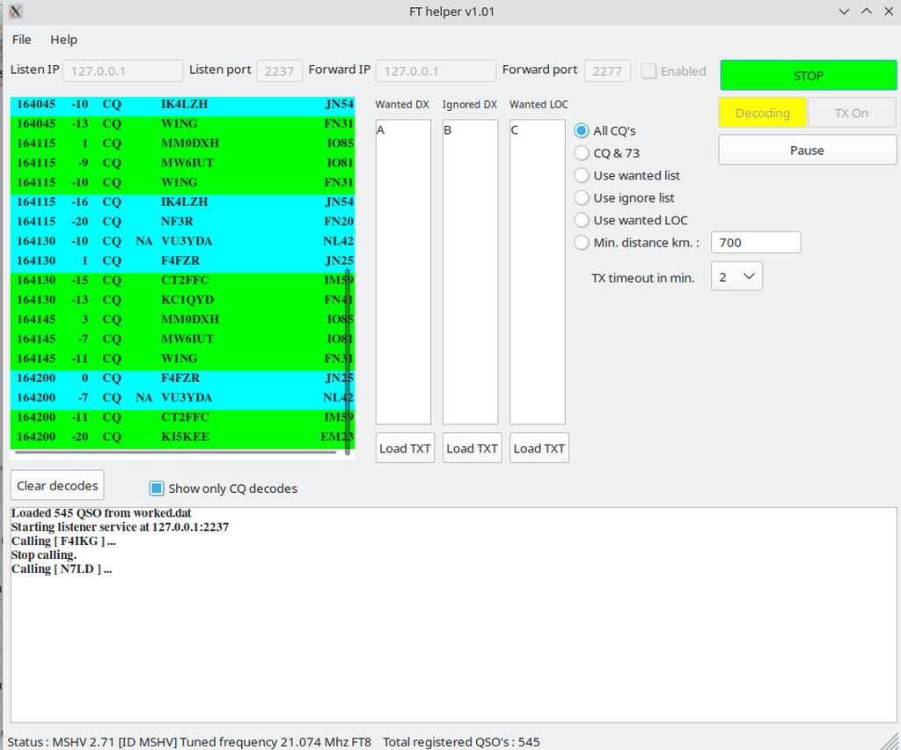

# FTHelper - FT4/FT8 QSO monster
FT8/FT4 QSO automation for MSHV/WSJT/JTDX

    v0.01	- let's decode begins !
    v1.00	- first initiated and logged QSO with OE4RGC 23.10.13 10:44 LTU FT8
		  For now programm tries to make QSO's with first non-worked CQ-calling station in decodes.
    	  This list is renewed every time slot.
    v1.01	 improved messages list both for linux and windows, used wxlisctrl
    v1.02	 "Wanted DX" is working
    v1.03	 "Ignored DX" and "Wanted LOC" is working
    v1.04	 "Min. distance" is working
    v1.055	 Import ADIF is working

    sudo apt install libwxgtk3.2-dev
